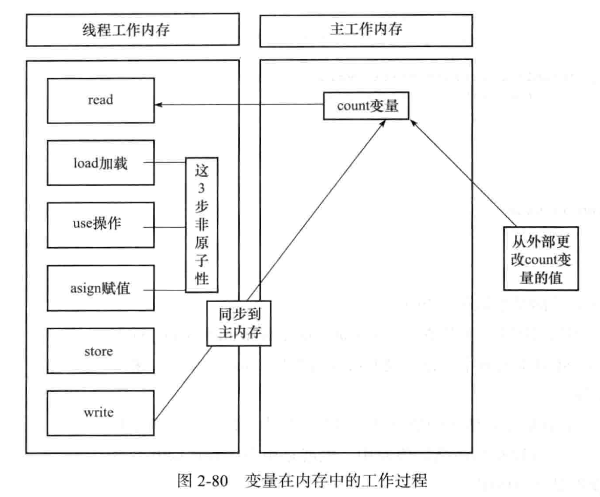

## 《Java多线程编程核心技术》读书笔记

### interrupted和isInterrupted的区别

this.interrupted()：测试当前线程是否已经中断

this.isInterrupted()：测试线程是否已经中断


```java
/**
 * @author kokio
 * @create 2019-04-28 18:23
 */
public class Run8 {
    public static void main(String[] args) {
        try {
            MyThread7 t7 = new MyThread7();
            t7.start();
            Thread.sleep(1000);
            t7.interrupt();
            System.out.println("是否停止1? " + Thread.interrupted());
            System.out.println("是否停止2? " + t7.interrupted());

        } catch (InterruptedException e) {
            System.out.println("main catch");
            e.printStackTrace();
        }
        System.out.println("end");
    }
}

```


测试结果

```markdown
。
。
。
i= 50000
是否停止1? false
是否停止2? false
end
```

由于停止的并非是当前main线程，所以interrupted()方法返回的都是false。

当当前线程被中断时

```java
/**
 * @author kokio
 * @create 2019-04-28 18:39
 */
public class Run8two {
    public static void main(String[] args) {
        Thread.currentThread().interrupt();
        System.out.println("是否停止？ " + Thread.interrupted());
        System.out.println("是否停止？ " + Thread.interrupted());
        System.out.println("end");
    }
}

```

结果

```markdown
是否停止？ true
是否停止？ false
end
```

而至于为什么第二个返回是false，是因为interrupted方法具有清除的功能，当第一次使用之后，将中断状态清除了，那么紧接着第二次调用就无法判断了，所以返回false。

使用isInterrupted()方法

```java

/**
 * @author kokio
 * @create 2019-04-28 19:08
 */
public class Run8Three {
    public static void main(String[] args) {
        try {
            MyThread7 myThread = new MyThread7();
            myThread.start();
            Thread.sleep(100);
            myThread.interrupt();

            System.out.println("是否中断1 " + myThread.isInterrupted());
            System.out.println("是否中断2 " + myThread.isInterrupted());
        } catch (InterruptedException e) {
            System.out.println("main catch");
            e.printStackTrace();

        }
        System.out.println("main end");

    }
}
```

结果

```markdown

i= 17785
是否中断1 true
i= 17786
i= 17787
是否中断2 true
main end
i= 17788
```

可以看到两次返回都为true，isInterrupted方法不具备清除标记的能力，所以一直为true。

### 线程的优先级

#### 线程的优先级继承性

在Java中，线程的优先级具有继承性，比如A线程启动B线程，则B线程的优先级与A是一样的。

```java
/**
 * @author kokio
 * @create 2019-04-30 18:36
 */
public class MyThread13 extends Thread {
    @Override
    public void run() {
        System.out.println("MyThread13 run priority = " + this.getPriority());
        MyThread14 myThread14 = new MyThread14();
        myThread14.start();
    }
}


/**
 * @author kokio
 * @create 2019-04-30 18:39
 */
public class MyThread14 extends Thread {
    @Override
    public void run() {

        System.out.println("MyThread14 run priority = " + this.getPriority());

    }
}


/**
 * @author kokio
 * @create 2019-04-30 18:39
 */
public class Run1314 {
    public static void main(String[] args) {
        System.out.println("main thread begin priority = " + Thread.currentThread().getPriority());
        Thread.currentThread().setPriority(9);
        System.out.println("main thread end priority = " + Thread.currentThread().getPriority());
        MyThread13 myThread13 = new MyThread13();
        myThread13.start();
    }
}
```

结果

```markdo
main thread begin priority = 5
main thread end priority = 9
MyThread13 run priority = 9
MyThread14 run priority = 9
```

#### 优先级具有规则性

cpu尽量将执行资源让给优先级比较高的线程

#### 优先级具有随机性

优先级较高的线程并不一定每一次都先执行完run（）方法中的任务，线程优先级与打印顺序无关，他们的关系具有不确定性和随机性


### 守护线程

当线程中不存在非守护线程了，则守护线程自动销毁。典型的守护线程就是垃圾回收线程。

```java

/**
 * @author kokio
 * @create 2019-04-30 18:58
 */
public class MyThread15 extends  Thread {
    private int i = 0;
    @Override
    public void run() {
        try {
            while (true){
                i++;
                System.out.println("i=" + (i));
                Thread.sleep(1000);
            }
        }catch (InterruptedException e){
            e.printStackTrace();
        }
    }
}


/**
 * @author kokio
 * @create 2019-04-30 19:00
 */
public class Run15 {
    public static void main(String[] args) {
        try {
            MyThread15 myThread15 = new MyThread15();
            myThread15.setDaemon(true);
            myThread15.start();
            Thread.sleep(5000);
            System.out.println("主线程没了，thread也不打印");
        }catch (InterruptedException e){
            e.printStackTrace();
        }
    }
}

```

结果

```markdown
i=1
i=2
i=3
i=4
i=5
主线程没了，thread也不打印
```
## chapter2

### synchronized方法

#### 方法内的变量为线程安全

#### 实例变量非线程安全

可以通过添加关键词synchronized来保证线程安全。

#### synchronized方法与锁对象

1. A线程先持有object对象的Lock锁，B线程可以以异步的方式调用object对象中的非synchronized类型的方法
2. A线程先持有object对象的Lock锁，B线程如果在这段时间调用object对象中的synchronized类型的方法则需要等待，也就是同步。

#### synchronized 锁重入

关键词synchronized拥有锁重复的功能，也就是在是用synchronized时，当一个线程得到一个对象锁后，再次请求此对象锁时是可以再次得到该对象的锁的。这也证明在一个synchronized方法/块内部调用贝类的其他synchronized方法/块时，是永远可以得到锁的。

#### 当出现异常时，锁自动释放

当一个线程执行的代码出现异常时，起所持有的锁会自动释放。

#### 同步不具有继承性

### synchronized同步块

synchronized方法是对当前对象进行加锁，而synchronized代码块是对某一个对象进行加锁

当一个线程访问object的一个synchronized同步代码块时，另一个线程仍然可以访问该object对象中的非synchronized同步代码块。

在使用同步synchronized（this）代码块时需要注意的是，当一个线程访问object的一个synchronized（this）同步代码块时，其他线程对同一个object中所有其他synchronized（this）同步代码块的访问将被阻塞，这说明synchronized使用的"对象监视器"是一个

和synchronized方法一样，synchronized(this)代码块也是锁定当前对象的。


synchronized同步方法和synchronized(this)同步代码块分别有两种作用

- synchronized同步方法
  - 对其他synchronized同步方法或synchronized(this)同步代码块调用呈阻塞状态
  - 同一时间只有一个线程可以执行synchronized同步方法中的代码
- synchronized(this)同步代码块
  - 对其他synchronized同步方法或synchronized(this)同步代码块调用呈阻塞状态
  - 同一时间只有一个线程可以执行synchronized(this)同步代码块中的代码


#### 同步代码块使用非this对象做对象监视器

同步代码块可以使用其他的实例变量或方法的参数，来作为对象监视器使用格式synchroinzed(非this对象)

1. 在多个线程持有"对象监视器"为同一个对象的前提下，同一时间只有一个线程可以执行synchroinzed(非this对象 x)同步代码块中的代码
2. 当持有"对象监视器"为同一个对象的前提下，同一时间只有一个线程可以执行synchronized(非this对象 x)同步代码块中的代码

锁非this对象具有一定的优点：如果在一个类中有很多个synchronized方法，这是虽然能实现同步，但会收到阻塞，所以影响运行效率；但如果使用同步代码块锁非this对象，则synchronized(非this)代码块中的程序与同步方法是异步的，不与其他锁this同步方法争抢this锁，则可以提高运行效率。


当x对象本身作为“对象监视器”时：

1. 当多个线程同时执行synchronized(x){}同步代码块时呈同步效果
2. 当其他线程执行x对象中synchronized同步方法时呈同步效果
3. 当其他线程执行x对象方法里面的synchronized(this)代码块时也呈现同步效果
4. 如果其他线程调用不加synchronized关键字的方法时，还是异步调用


#### 线程池常量做“对象监视器”

由于线程池常量是唯一，所以如果以此来作为锁的话，那么多个线程就会阻塞。


#### 同步synchronized方法无限等待和解决

使用同步方法容易死循环，原因是因为锁的是同一个对象，所以造成死锁，而使用同步代码块，就可以使用不同的锁对象，从而解决该问题。


### volatile

使用volatile关键字增加了实例变量在多个线程之间的可见性，但volatile关键词的缺点是不支持原子性。

#### synchronized和volatile比较

1. 关键字volatie是线程同步的轻量级实现，所以volatile性能肯定比synchronized要好，并且volatile智能修饰于变量，而synchronized可以修饰方法，以及代码块。但随着者JDK新版本的发布，synchronized关键字在执行效率上得到提升。
2. 多线程访问volatile不会发生阻塞，而synchronized会出现阻塞
3. volatile能保证数据的可见性，但不能保证原子性；而synchronized可以保证原子性，也可以间接保证可见性，因为它会将私有内存和公共内存中的数据做同步
4. volatile解决的事变量在多个线程之间的可见性；而synchronized解决的事多个线程之间访问资源的同步性。

#### volatile的非原子性

变量在内存中工作的过程



1. read和load阶段：从主存复制到到当前线程工作内存；
2. use和assign阶段：执行代码，改变恭喜那个变量值；
3. store和write阶段：用工作内存数据刷新主存对应变量的值

对于volatile修饰的变量，JVM虚拟机只是保证从主内存加载到线程工作内存的值事最新的，例如线程1和线程2在进行read和load的操作，发现主内存中count的值都是5，那么都会加载这个最新的值。也就是说，volatile关键字解决的是读时的可见性问题，但无法保证原子性，对于多个线程访问同一个实例变量还是需要加锁同步。

关键字synchronized可以保证在同一时刻，只有一个线程可以执行某一方法或某一个代码块。它包含连个特征：互斥性和可见性。同步synchronized不经可以解决一个线程看到对象处于不一致的状态，还可以保证进入同步方法或者同步代码块的每个线程，都卡拿到由同一个锁保护之前所有的修改效果

## Chapter3

### 等待/通知机制

关键字synchronized可以将任何一个Object对象作为同步对象来看待，而java为每个Object都实现了wait()和notify()方法。他们必须用在呗synchronized同步的Object的临界区内。通过调用wait()方法可以时处于临界区内的线程进入等待状态，同时解放被同步对象的锁。而notify操作可以换行一个因调用了wait操作而处于阻塞状态中的线程，使其进入就绪状态。被重新唤醒的线程会试图重新获得临界区的控制权，也就是锁，并继续执行临界区内wait之后的代码。如果发出notify操作时没有处于阻塞状态中的线程，那么该命令就会被忽略。

- wait() 方法可以时调用该方法的线程释放共享资源的锁，然后从运行状态中退出没进入等待队列，直到被再次唤醒。
- notify() 方法可以随机换行等待队列中等待统一共享资源的"一个"线程，并使该线程退出等待队列，进入可运行状态，notify()方法只唤醒"一个"线程。另外需要注意的是：执行notify()之后，当前线程不会马上释放对象锁，呈wait状态的线程也并不能马上获取该对象锁，要等到执行notify()方法的线程将程序执行完，也就是退出synchronized，当前线程才会释放锁。
- notifyall() 方法可以使所有正在等待队列中等待统一共享资源的"全部"线程从等待状态退出，进入可运行状态。此时，优先级最高的那个线程最先执行，但也有可能是随机执行，要取决于JVM虚拟机的实现。


#### 多生产者和多消费者会产生假死状态

使用notify唤醒时，在多生产者和多消费者的情况下，唤醒的可能是同类线程，即已经生产了，需要唤醒消费者，而notify唤醒的又是生产者，所以导致最后线程全部进入wait状态，形成假死。所以解决这种问题的方式是将notify改成notifyAll方法


#### 生产者消费者总结

1. 你可以使用wait和notify函数来实现线程间通信。你可以用它们来实现多线程（>3）之间的通信。

2. 永远在synchronized的函数或对象里使用wait、notify和notifyAll，不然Java虚拟机会生成 IllegalMonitorStateException。

3.  永远在while循环里而不是if语句下使用wait。这样，循环会在线程睡眠前后都检查wait的条件，并在条件实际上并未改变的情况下处理唤醒通知。

4. 永远在多线程间共享的对象（在生产者消费者模型里即缓冲区队列）上使用wait。

5.  倾向用 notifyAll()，而不是 notify()。


#### join()方法

方法join的作用是使所属的线程对象x正常执行run()方法中的任务，而使当前线程z进行无限期的阻塞，等待线程x销毁后再继续执行线程z后面的代码。

方法join具有使线程排队的作用，有些类似同步的运行效果。join和synchronized的却别使：join在内部使用wait方法进行等待，而synchronized关键字使用的是"对象监视器"原理作为同步。


#### join方法原理

join方法源码

```java

 public final synchronized void join(long millis)
    throws InterruptedException {
        long base = System.currentTimeMillis();
        long now = 0;

        if (millis < 0) {
            throw new IllegalArgumentException("timeout value is negative");
        }

        if (millis == 0) {
            while (isAlive()) {
                wait(0);
            }
        } else {
            while (isAlive()) {
                long delay = millis - now;
                if (delay <= 0) {
                    break;
                }
                wait(delay);
                now = System.currentTimeMillis() - base;
            }
        }
    }
```

join() 是一个synchronized方法， 里面调用了wait()，这个过程的目的是让持有这个同步锁的线程进入等待，那么谁持有了这个同步锁呢？答案是主线程，因为主线程调用了threadA.join()方法，相当于在threadA.join()代码这块写了一个同步代码块，main线程会获得线程对象threadA的锁，谁去执行了这段代码呢，是主线程，所以主线程被wait()了。然后在子线程threadA执行完毕之后，JVM会调用lock.notify_all(thread);唤醒持有threadA这个对象锁的线程，也就是主线程，会继续执行。


#### threadlocal

ThreadLocal可以使每一个线程都拥有自己的共享变量

InheritableThreadLocal 可以使子线程获取到父线程的值。

## chapter4

在JDK1.5中新增加了ReentrantLock类，可以和synchronized达到相同的效果，还扩展了其他功能（嗅探锁定，多路分支通知），更加灵活了。

### 等待/通知模式

Object类中的wait()方法相当于Condition类中的await()方法。

Object类中的wait(long timeout)方法相当于Condition类中的await(long time，TimeUnit unit)方法。

Object类中的notify()方法相当于Condition类中的signal()方法。

Object类中的notifyAll()方法相当于Condition类中的signalAll()方法。

```java
/**
 * @author kokio
 * @create 2019-05-17 19:33
 */
public class Four14MyService {
    private Lock lock = new ReentrantLock();
    public Condition condition = lock.newCondition();

    public void await() {
        try {
            lock.lock();
            System.out.println(" await 的时间为 " + System.currentTimeMillis());
            condition.await();
        } catch (InterruptedException e) {
            e.printStackTrace();
        } finally {
            lock.unlock();
        }
    }

    public void signal() {
        try {
            lock.lock();
            System.out.println("signal的时间为 " + System.currentTimeMillis());
            condition.signal();
        } finally {
            lock.unlock();
        }

    }
}


/**
 * @author kokio
 * @create 2019-05-17 19:37
 */
public class Four14ThreadA extends Thread {
    private Four14MyService service;

    public Four14ThreadA(Four14MyService service) {
        this.service = service;
    }

    @Override
    public void run() {
        service.await();
    }
}


public class Four14Run {
    public static void main(String[] args) {
        try {
            Four14MyService service = new Four14MyService();

            Four14ThreadA threadA = new Four14ThreadA(service);
            threadA.start();

            Thread.sleep(3000);
            service.signal();
        } catch (InterruptedException e) {
            e.printStackTrace();
        }
    }
}
```

结果

```markdown
 await 的时间为 1558093211859
signal的时间为 1558093214861
```

如果想要唤醒部分线程，就可以使用多个Condition对象，来进行完成。

### 公平锁和非公平锁

```markdown
	lock = new ReentrantLock(isFair)
  
  这里的isFair代表是否为公平锁的参数，如果true则为公平锁，那么就是先start的线程，先获得锁，如果是false，那么并不代表先启动的线程先获得锁。
  
```

### lock的一些方法

这些感觉不是很有必要，眼熟一下，API中都有。

#### getHoldCount()

查询当前线程保持此锁定的个数，也就是调用lock()方法的次数。

#### getQueueLength()

返回正等待获取此锁定的线程估计数，比如有5个线程，1个线程首先执行sleep（这里书中错了，他写的是await方法，这个方法会释放锁,最终导致getQueueLength()方法获得的线程数为0），那么在调用getQueueLength()方法后返回的是4，说明有4个线程在同时等待lock的释放。

```java
//使用await的代码
public class Four110Myservice {
    public ReentrantLock lock = new ReentrantLock();
    private Condition condition = lock.newCondition();
    public void serviceMethod1(){
        try {
            lock.lock();
            System.out.println("ThreadName= " + Thread.currentThread().getName() + "进入方法");
            condition.await();
        } catch (InterruptedException e) {
            e.printStackTrace();
        } finally {
            lock.unlock();
        }

    }

}
```

结果

```markdown
ThreadName= Thread-0进入方法
ThreadName= Thread-2进入方法
ThreadName= Thread-3进入方法
ThreadName= Thread-4进入方法
ThreadName= Thread-1进入方法
ThreadName= Thread-6进入方法
ThreadName= Thread-5进入方法
ThreadName= Thread-7进入方法
ThreadName= Thread-8进入方法
ThreadName= Thread-9进入方法
有线程数0正在等待
```

使用sleep方法的代码

```java
public class Four110Myservice {
    public ReentrantLock lock = new ReentrantLock();
//    private Condition condition = lock.newCondition();
    public void serviceMethod1(){
        try {
            lock.lock();
            System.out.println("ThreadName= " + Thread.currentThread().getName() + "进入方法");
//            condition.await();
            Thread.sleep(Integer.MAX_VALUE);
        } catch (InterruptedException e) {
            e.printStackTrace();
        } finally {
            lock.unlock();
        }

    }

}

```

结果

```markdown
ThreadName= Thread-0进入方法
有线程数9正在等待
```


#### getWaitQueueLength(Condition condition)

此方法的作用是返回等待与此锁相关的给定条件Confition的线程估计数，比如有5个线程，每个线程都执行了同一个condition对象的await()方法，则调用getWaitQueueLength(Condition condition)方法时，返回的是5


#### hasQueuedThread()、hasQueuedThreads()

方法boolean hasQueuedThread(Thread thread)的作用是查询制定的线程是否正在等待获取此锁。

方法boolean hasQueuedThreads()的作用是查询是否有线程正在等待获取此锁。

#### hasWaiter(Condition condition)

此方法的作用是查询是否有线程正在等待与此锁有关的condition条件，可以和getWaitQueueLength方法一起用，获取准确的线程数


#### isFair()

此方法是判断是否为公平锁，在创建lock时,可以传入参数，选择是否创建公平锁，而默认情况下，ReentrantLock类使用的是非公平锁。

#### isHeldByCurrentThread()

此方法是查询当前线程是否保持此锁。

#### isLocked()

此方法是查询此锁是否由任意线程保持。


#### lockInterruptibly()

此方法的作用是：如果当前线程未被中断，则获取锁，如果已经被中断则出现异常。

#### tryLock()

此方法的作用是，调用时如果锁未被另一个线程获得的情况下，才获得该锁。

#### tryLock(long tiemout,TimeUnit unit)

此方法的作用：如果锁在给定等待时间内没有被另一个线程保持，而且线程未被中断，那么该线程就会获得锁。

#### awaitUninterruptibly()

此方法与await相似，不过此方法不会在等待过程中响应中断，如果当前线程的中断状态在进入此方法时设置，或者等待时为[interrupted](http://www.matools.com/file/manual/jdk_api_1.8_google/java/lang/Thread.html#interrupt--) ，则会继续等待直到发信号。 当它最终从该方法返回时，它的中断状态将仍然被设置。

#### awaitUntil()

使当前线程等待直到发出信号或中断，或者指定的最后期限过去。

### 使用Condition实现顺序执行

```java
/**
 * @author kokio
 * @create 2019-05-19 17:56
 */
public class Four116Run {
    public volatile static int nextPrintWho = 1;

    private static ReentrantLock lock = new ReentrantLock();
    private final static Condition conditionA = lock.newCondition();
    private final static Condition conditionB = lock.newCondition();
    private final static Condition conditionC = lock.newCondition();

    public static void main(String[] args) {
        Thread threadA = new Thread() {
            @Override
            public void run() {
                try {
                    lock.lock();
                    while (nextPrintWho != 1) {
                        conditionA.await();
                    }
                    for (int i = 0; i < 3; i++) {
                        System.out.println("threada " + (i + 1));
                    }
                    nextPrintWho = 2;
                    //B全部唤醒
                    conditionB.signalAll();

                } catch (InterruptedException e) {
                    e.printStackTrace();
                } finally {
                    lock.unlock();
                }
            }
        };

        Thread threadB = new Thread() {
            @Override
            public void run() {
                try {
                    lock.lock();
                    while (nextPrintWho != 2) {
                        conditionA.await();
                    }
                    for (int i = 0; i < 3; i++) {
                        System.out.println("threadb " + (i + 1));
                    }
                    nextPrintWho = 3;
                    //B全部唤醒
                    conditionC.signalAll();

                } catch (InterruptedException e) {
                    e.printStackTrace();
                } finally {
                    lock.unlock();
                }
            }
        };

        Thread threadC = new Thread() {
            @Override
            public void run() {
                try {
                    lock.lock();
                    while (nextPrintWho != 3) {
                        conditionA.await();
                    }
                    for (int i = 0; i < 3; i++) {
                        System.out.println("threadc " + (i + 1));
                    }
                    nextPrintWho = 1;
                    //B全部唤醒
                    conditionA.signalAll();

                } catch (InterruptedException e) {
                    e.printStackTrace();
                } finally {
                    lock.unlock();
                }
            }
        };

        Thread[] aArrays = new Thread[5];
        Thread[] bArrays = new Thread[5];
        Thread[] cArrays = new Thread[5];

        for(int i = 0; i< 5; i++){
            aArrays[i] = new Thread(threadA);
            bArrays[i] = new Thread(threadB);
            cArrays[i] = new Thread(threadC);

            aArrays[i].start();
            bArrays[i].start();
            cArrays[i].start();

        }
    }
}

```

结果

```markdown
threada 1
threada 2
threada 3
threadb 1
threadb 2
threadb 3
threadc 1
threadc 2
threadc 3
.
.
.
```


### ReentrantReadWriteLock类

类ReentrantLock具有完全互斥排他的效果，即同一时间只有一个线程在执行ReentrantLock.lock()方法后面的任务，虽然线程安全，但效率低下。

ReentrantReadWriteLock类 有两个锁，一个是读操作相关的锁，也称共享锁，一个是写操作相关的锁，也称排他锁；多个读锁止键不互斥，读锁与写锁呼哧，写锁和写锁互斥。在没有线程Thread进行写入操作时，进行读取操作的托哥Thread都可以获取读锁，而进行写入操作的Thread只有在获取写锁后才能进行写入操作。即多个Thread可以同时进行读取操作，但是同一时刻只允许一个Thread进行写入操作。

"读写"、"写读"、"写写"都是互斥的，而"读读"是异步的，非互斥的。